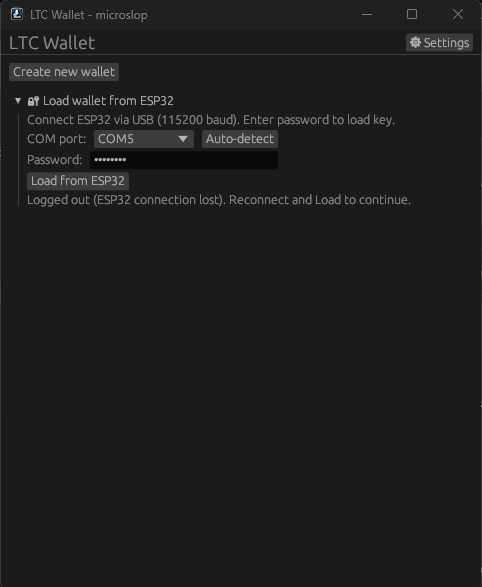

# microltc-espslop
ai shit wallet(only ltc all data stored in esp32)
# lang rust
download 
[win11/win10](https://github.com/hdmain/microltc-espslop/raw/refs/heads/main/LTC-Wallet-Setup-0.1.0.exe) 
[debian/based on debian](https://github.com/hdmain/microltc-espslop/raw/refs/heads/main/walletlinux.deb) 

# preview

